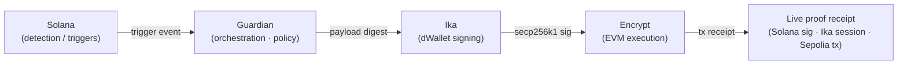

# Guardian — Cross-Chain Circuit Breaker

> **Solana signal → Ika dWallet policy sign → Encrypt EVM execution.**
> A proof-first operations console for cross-chain incident response: detect
> fast-chain precursors, bind policy with **Ika**, and act on **Ethereum** (or
> any EVM target) through **Encrypt**. The wired demo runs **vault evacuation
> on Sepolia**; the same pipeline also models **halting deposits, throttling
> bridge outflows, or blocking risky DEX routes** while operators investigate
> — especially relevant for **exchanges and custodians**.

**Live demo:** https://guardian-circuit-breaker.vercel.app/  
**Slide pitch (in-app):** https://guardian-circuit-breaker.vercel.app/#frontier-pitch  
**GitHub:** https://github.com/panagot/Guardian-Circuit-Breaker

---

## TL;DR for judges

1. The site auto-launches a **30-second tour** the first time you load it.
2. Open **Threat feed & proof** → click **Run live proof** on the
   *End-to-end proof* card.
3. Wait for the **Confirmed** phase → click the third artifact’s explorer link.
   That Sepolia transaction is the proof.

The sticky strip up top labelled **“UI storyline / Not on-chain”** is **only a
narrative animation**. The blockchain receipt is in the proof card.

---

## What it is

Guardian is **the missing operations layer** between fast-chain detection and
on-chain action.



| Layer        | Role                                                                                       |
| ------------ | ------------------------------------------------------------------------------------------ |
| **Solana**   | Where exploit precursors and triggers surface first — log signatures, mempool, accounts.   |
| **Guardian** | Listens, normalizes, binds policy, asks Ika for an authorization over a **specific** EVM payload. |
| **Ika**      | dWallet / threshold signing. Returns a **secp256k1 signature** for the payload digest.    |
| **Encrypt**  | EVM execution. Today: `EvacuationVault.evacuate(...)` on Sepolia. Tomorrow: pause, cap, allowlist, rotate. |

---

## Same pipeline, different calldata

The product story is **not** “evacuate everything” — it’s a **circuit breaker
shaped by policy**. Once Ika has signed an EVM payload, the receiving contract
can do whatever the protocol decides:

| Action                                | Signature                                            | Status in this repo            |
| ------------------------------------- | ---------------------------------------------------- | ------------------------------ |
| Evacuate vault to safe address        | `EvacuationVault.evacuate(reasonHash, solanaSig)`    | ✅ **Wired (live Sepolia tx)** |
| Halt deposits / withdrawals           | `Vault.setPaused(true, policyDigest)`                | 🟧 Same pipeline, described    |
| Throttle bridge outflows              | `Bridge.setOutflowCap(amountPerBlock, policyDigest)` | 🟧 Same pipeline, described    |
| Block risky DEX router                | `Router.setRouterAllowlist(addr, false, ...)`        | 🟧 Same pipeline, described    |
| Rotate guardian / signer set          | `Vault.rotateGuardians(newSet, policyDigest)`        | ⬜ Roadmap                     |

**Architecture is identical.** Only the contract method changes — see the
**“Policy actions”** card on the Threat feed page in the running app.

---

## Why Ika and Encrypt are central

- **Without Ika**, you fall back to **hot keys**, **slow multisigs**, or
  **opaque custodial signers** under incident pressure — which is exactly
  where production incidents break down today.
- **Without Encrypt (EVM execution)**, you can *see* the Solana signal but
  **cannot enforce** outcomes where treasuries, routers, and bridges live.
  You end up with **alerts**, not **attestable on-chain action**.

Guardian binds them into **one continuous proof**: the UI shows
**Solana sig → Ika session → Ethereum tx** in a single receipt object, not
three disconnected dashboards.

---

## Architecture

```text
┌──────────────────┐    SSE / fetch     ┌──────────────────────────────┐
│  Frontend (Vite) │ ◀────────────────▶ │  Backend (Express + Node)    │
│  React + MUI     │                    │  Event-driven proof pipeline │
└────────┬─────────┘                    └─────────┬────────────────────┘
         │                                        │ Solana onLogs (real)
         │ render proof artifacts                 │ or manual /api/trigger
         │                                        ▼
         │                       ┌────────────────────────────────────┐
         │                       │  Solana trigger listener           │
         │                       │  • CIRCUIT_BREAKER_TRIGGERED match │
         │                       └─────────────┬──────────────────────┘
         │                                     │ solana.trigger
         │                                     ▼
         │                       ┌────────────────────────────────────┐
         │                       │  Ika dWallet adapter                │
         │                       │  • payload digest = keccak(payload) │
         │                       │  • dWallet returns secp256k1 sig    │
         │                       └─────────────┬──────────────────────┘
         │                                     │ ika.signed
         │                                     ▼
         │                       ┌────────────────────────────────────┐
         │                       │  Sepolia evacuator (ethers v6)     │
         │                       │  • EvacuationVault.evacuate(...)   │
         │                       └─────────────┬──────────────────────┘
         ▼                                     │ ethereum.confirmed
┌────────────────────┐  ◀─────────────────────┘
│ End-to-end proof   │   live updates (typed event bus, SSE fan-out)
│ card on Threat Feed│
└────────────────────┘
```

The **typed event bus** (`backend/src/eventBus.ts`) is the source of truth.
Every state transition (`solana.trigger`, `ika.signing`, `ika.signed`,
`ethereum.broadcasting`, `ethereum.broadcast`, `ethereum.confirmed`,
`pipeline.completed`, `pipeline.retry`, `pipeline.failed`) is one event
that the proof store, the SSE stream and the UI all subscribe to.

---

## Repo layout

```
.
├── src/                    # React + MUI frontend (Vite)
│   ├── App.tsx             # Shell, routing, judge tour, pitch deck
│   ├── JudgeTour.tsx       # First-load 30-second guided tour
│   ├── FrontierPitchPresentation.tsx  # In-app slide deck (#frontier-pitch)
│   ├── PolicyActionsPanel.tsx         # "Same pipeline, different calldata"
│   ├── SimulationCockpit.tsx          # Top strip — UI storyline only
│   ├── pages/                          # Overview · Vault manager · Threat feed · Protocol story
│   └── live/                           # SSE provider, ProofCard, types
├── backend/                # Express + tsx-watch backend
│   ├── src/api.ts          # /api/health · /api/ready · /api/trigger · /events
│   ├── src/pipeline.ts     # solana → ika → sepolia state machine
│   ├── src/ika/            # adapter, mockAdapter, realAdapter (HTTP bridge)
│   ├── src/ethereum/       # Sepolia evacuator (ethers v6)
│   ├── src/solana/         # Devnet listener
│   └── .env.example        # Every config flag with comments
├── contracts/              # EvacuationVault.sol + deploy scripts
├── scripts/                # check.mjs · trigger.mjs · fund-vault-sepolia.mjs · …
└── README.md               # ← you are here
```

---

## Quickstart (local)

Requirements: **Node 20+**, **npm 10+**.

```bash
# 1. Install (root + backend + contracts handle their own node_modules)
npm install
npm install --prefix backend

# 2. Copy env, fill any credentials you have
cp backend/.env.example backend/.env
#   PIPELINE_MODE=mock      → demo runs offline (deterministic triggers)
#   PIPELINE_MODE=real      → real Solana / Ika bridge / Sepolia broadcast
#   GUARDIAN_REQUIRE_REAL_SEPOLIA=1  → strict mode for prize demos

# 3. Run frontend + backend with one command
npm run dev:all
#   frontend:  http://localhost:5173
#   backend:   http://localhost:8787

# 4. (optional) sanity check — should print sepolia=real / ika=real / solana=real
node scripts/check.mjs
```

Open `http://localhost:5173` → **Threat feed & proof** → **Run live proof**.

### Useful npm scripts

| Script                          | What it does                                                  |
| ------------------------------- | ------------------------------------------------------------- |
| `npm run dev:all`               | Vite + backend in one terminal (Windows-safe)                |
| `npm run typecheck`             | Frontend TS check                                             |
| `npm run typecheck:backend`     | Backend TS check                                              |
| `npm run build`                 | Production frontend build (chunk-split for Vercel)            |
| `npm run demo:check`            | Hits `/api/health` + `/api/ready` and prints capabilities     |
| `npm run demo:check-funds`      | Verifies vault + relayer funds on Sepolia                     |
| `npm run demo:fund-vault`       | Sends a small amount of Sepolia ETH into the vault            |
| `npm run demo:trigger`          | Manually drives a pipeline run                                |
| `npm run deploy:vault`          | Compiles and deploys `EvacuationVault.sol` to Sepolia         |
| `npm run ika:bridge`            | Starts the local Ika HTTP signing bridge                      |

---

## Real vs mock — one source of truth

Capabilities are computed in `backend/src/config.ts → detectCapabilities()`.

| Capability    | Required env                                                                 |
| ------------- | ---------------------------------------------------------------------------- |
| `realSolana`  | `PIPELINE_MODE=real` + `SOLANA_TRIGGER_ACCOUNT` + `SOLANA_RPC_URL`            |
| `realIka`     | `PIPELINE_MODE=real` + `IKA_SIGN_HTTP_URL` + `IKA_DWALLET_ID`                 |
| `realSepolia` | `PIPELINE_MODE=real` + `SEPOLIA_RPC_URL` + `EVACUATION_VAULT_ADDRESS` + `SEPOLIA_RELAYER_PRIVATE_KEY` |

If `realSepolia` is **off**, the proof card warns clearly. If
`GUARDIAN_REQUIRE_REAL_SEPOLIA=1` and Sepolia is not configured,
`POST /api/trigger` returns **`503`** with a hint — no mock fallback.

---

## Deploying for live judge access

You need two services: a **static frontend on Vercel** and a **Node backend
on a long-running host** (Railway, Render, Fly, or any VPS). The Express
backend keeps an SSE connection open and **cannot** run as a Vercel
serverless function.

### Backend → Railway (recommended, ~3 min)

The repo ships a `railway.json` so Railway picks up the right build/start
commands. The backend's `npm start` is **`node ./scripts/start-prod.mjs`**,
which auto-launches the **Ika HTTP signing bridge** on the same machine
when `IKA_BRIDGE_PRIVATE_KEY` is set, then starts the API. One service,
one process group.

1. **Railway → New project → Deploy from GitHub repo** → select
   `panagot/Guardian-Circuit-Breaker`.
2. Railway picks up `railway.json` automatically. Build:
   `cd backend && npm ci && npm run build`. Start: `cd backend && npm start`.
3. **Variables** (mirror your local `backend/.env`, but **never commit**):
   - `PIPELINE_MODE=real`
   - `GUARDIAN_REQUIRE_REAL_SEPOLIA=1`
   - `PORT=8787`
   - `ALLOWED_ORIGIN=https://guardian-circuit-breaker.vercel.app`
   - `SOLANA_RPC_URL`, `SOLANA_WS_URL`, `SOLANA_TRIGGER_ACCOUNT`,
     `SOLANA_DEMO_SECRET_BASE64`
   - `IKA_BRIDGE_PRIVATE_KEY` (32-byte hex; this is what the in-process
     bridge signs with), `IKA_DWALLET_ID`
   - `SEPOLIA_RPC_URL`, `EVACUATION_VAULT_ADDRESS`,
     `SEPOLIA_RELAYER_PRIVATE_KEY`, `SAFE_DESTINATION_ADDRESS`
4. Wait for the green **Deployed**. Test:
   `curl https://<your-railway-domain>/api/health` should return JSON with
   `caps.realSepolia: true`.

> **Render alternative:** the repo also ships `render.yaml`. Same env vars.

### Frontend → Vercel

1. Import `panagot/Guardian-Circuit-Breaker` in Vercel.
2. **Framework:** Vite. **Build command:** `npm run build`. **Output:** `dist`.
3. **Environment Variables → Production** add:
   `VITE_BACKEND_URL=https://<your-railway-domain>` (no trailing slash).
4. **Redeploy**.

### Verify (judge view)

Open the deployed Vercel URL:

- ✅ **Topbar “Backend live”** pill is green (top-right).
- ✅ The blue **“Live API not yet connected”** banner is **gone**.
- ✅ Sticky **green** strip: *“Live Sepolia pipeline is on — this is real.”*
- ✅ Threat feed → proof card → **Run live proof** → wait for *Confirmed*
  → click the third artifact's explorer link → real Sepolia tx.

If the green banner is missing, hit `https://<your-railway-domain>/api/ready`
and read the warnings — the script `node scripts/check.mjs --backend ...`
prints the same report locally.

---

## Threat model & limitations

- **Today** one EVM action is fully wired (`evacuate` on Sepolia). Adding
  more is **product mapping** (new contract methods / calldata), **not** a
  new architecture.
- **Ika** is integrated through an adapter so production Ika and a dev HTTP
  signing bridge are interchangeable in the same code path.
- **Hardening for production:** strict Ika integration (no dev bridge),
  stricter monitoring, key ceremony, multi-network Encrypt deploys, and a
  formal incident playbook beyond the demo checklist.
- **Simulation strip** is **never** a chain receipt — it’s an animated
  storyline so reviewers can see the policy graph without running a tx.

---

## Users at a glance

| User           | What they get                                                                                        |
| -------------- | ----------------------------------------------------------------------------------------------------- |
| Protocol ops   | Real-time visibility into trigger → sign → act (pause routes, throttle, or evacuate) with copyable artifacts. |
| Treasury risk  | Auto-pause, bridge/DEX halts, and migration to allowlisted vaults without paging a multisig.         |
| Auditors       | One end-to-end proof object per incident: Solana sig + Ika session + Sepolia tx.                     |
| Exchanges/CEX  | Attestable deposit/withdrawal halts, bridge throttles, and route blocks during investigation.        |
| Demo judges    | A clearly-labeled real-vs-mock matrix so it's obvious what is on-chain right now.                    |

---

## License

MIT © Guardian contributors.
